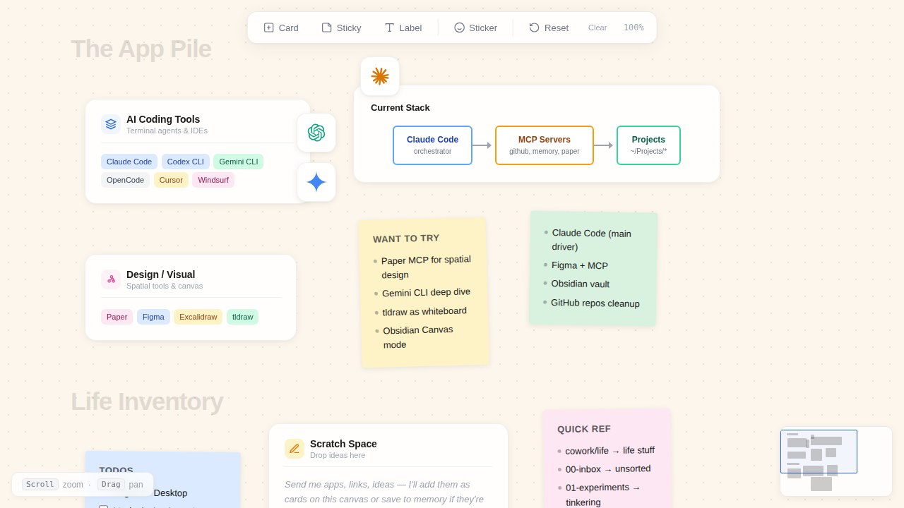

# Visual Canvas

A spatial canvas for organizing ideas, tools, and AI collaborations — built by Lupo Studios.

Visual Canvas provides a freeform, infinite board to lay out everything you're working with: tools, models, notes, and architecture diagrams. It's not a list or a dashboard; it's a dedicated spatial environment that helps you actually *see* how everything connects.



## Key Features

- **Infinite Spatial Environment**: Pannable and zoomable canvas to map out your entire workflow.
- **Draggable Components**: Intuitive cards that snap to a 12px grid for perfect alignment.
- **AI Model Sticker System**: Place brand-accurate AI model badges across your canvas.
- **Real-time Minimap**: Easily navigate your canvas with a viewport minimap.
- **Dot Grid Background**: A subtle background grid for precise spatial orientation.
- **Modern Aesthetic**: Glass panel styling with backdrop blur and smooth entrance animations.
- **Accessible & Zero Dependencies**: Respects `prefers-reduced-motion`, is keyboard navigable, and works entirely offline with zero build dependencies.

## Tech Stack

- **HTML5**
- **CSS3** (with CSS Variables & modern styling)
- **Vanilla JavaScript** (Zero dependencies)

## Getting Started

Because Visual Canvas relies entirely on vanilla web technologies, getting started is extremely easy. No build steps, no package managers.

### 1. Clone the repository
```bash
git clone https://github.com/your-username/visual-canvas.git
cd visual-canvas
```

### 2. Run the application
Start a local web server in the project directory.

Using Python 3:
```bash
python3 -m http.server 3000
```

Using Node.js (`serve`):
```bash
npx serve .
```

### 3. View the application
Open your browser and navigate to `http://localhost:3000` to start organizing!

## Usage Guide

- **Pan**: Click and drag the canvas background.
- **Zoom**: Use your scroll wheel (zooms toward your cursor).
- **Drag**: Click and drag any card or sticker to reposition it.
- **Toolbar**: Use the top-center toolbar to create new cards, sticky notes, labels, or stickers.
- **Keyboard Shortcuts**:
  - `Cmd+0` (or `Ctrl+0`): Reset view
  - `Cmd+=` (or `Ctrl+=`): Zoom in
  - `Cmd+-` (or `Ctrl+-`): Zoom out

## Roadmap

- **Save/load state**: Persist card positions and content to `localStorage` or file export.
- **Connector lines**: Draw relationships between cards with draggable bezier curves.
- **Image cards**: Drop images onto the canvas as a new card type.
- **Grouping**: Select multiple cards and move them as a cluster.
- **Search**: Find cards by content across a large canvas.

## License

MIT — Lupo Studios
